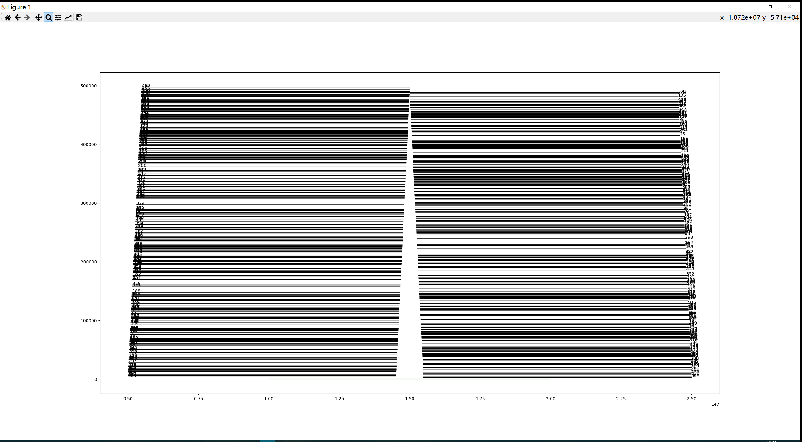

#随便写写icpc world final -- 2019 F Directing Rainfall 题解

想随便找点事情做，就找了点icpc world final的题来写一写，由于之前完全没有acm的经验，又刚好挑了19年最难的一题之一来写，前前后后一共写了三个星期才AC了，这篇题解以一个非竞赛者，而是一个软件工程师的视角来探讨下。

##问题简述
问题大意就是将一些雨水顺着顶棚导到地上的植物处进行灌溉, 也可以在顶棚上打洞让水直接流下. 同时, 最后流下的水一定要在植物的正上方, 要求最少要在多少个顶棚上打洞才能满足.

##问题算法解析

问题算法可以参考官方题解视频：https://www.youtube.com/watch?v=GISocxWB8Mk ，
或者http://www.csc.kth.se/~austrin/icpc/finals2019solutions.pdf ，
测试的数据可以在https://icpc.global/worldfinals/problems找到。

问题的解答可以分成三个大步骤：
1.如果tarp a的水在不打洞的情况下，能滴到另一个tarp b上，那么称tarp a依赖于tarp b。从x轴左到右扫描，将各个tarp的依赖关系找出来，形成一张有向无环图。
2.将上一步中的有向无环图进行拓扑排序，得到一个tarp序列。
3.使用动态规划的方法求解问题。做一个无限长的dp数组，初始化将[L,R]的区间置为0，其他位置置为∞，然后按照上面的拓扑排序序列，从后往前按照一定规则更新dp数组，更新完最后一个tarp后，从[L,R]区间内找最小值，就是答案。

###依赖获取

先注意到一个很重要的题设，题目中所有的tarp的x坐标和L、R都是不同的，一开始我没注意到这个前提，整个问题的复杂度一下大了很多，我也写了一个可以有相同横坐标的代码版本，这里就不提了，想了解的可以翻一下commit记录。
有了这个前提后，从x轴从左到右地扫描, 用一个有序set维护目前扫描到的tarp, set的排序依据是当前x坐标下各个tarp所处的y坐标。遇到tarp的左端点就将其加入set，遇到右端点就移出set。更新依赖只有两种情况，一是加入新tarp的时候，在set内处于它下方的tarp会被它依赖，处于它上方的tarp会依赖它；二是当一个tarp离开set的时候,它上方的tarp的水可以在这个点下落到它下方的tarp上,由此产生依赖。两种更新依赖的方法可能会产生重复的依赖，不过在后面的拓扑排序中这个影响会被消除。
由于操作只会在tarp的端点发生,所以可以在读入数据的时候存一下tarp的两个端点和进出,然后按横坐标排序,扫描的时候每次只取端点坐标即可.

###拓扑排序
这个就是很常规的拓扑排序就可以了，被依赖的排在前面，依赖其他tarp的排在后面。

###动态规划求解
初始化一个无限长的dp数组，数组下标是空间横坐标，数组内容是当前横坐标上有水落下需要打穿最少的tarp数。由于只有[L,R]下落的水最后落回[L,R]才是合法的解，初始化将[L,R]的区间置为0，其他位置置为∞。
依据上面拓扑排序的结果，从后往前，模拟水一层层的流经每一个tarp，更新dp数组。dp主要有两种操作，代码里称为roll（滚动）和add（加一）。roll的含义是对于每一个tarp，设它的较高一边端点横坐标为x2，较低的为x1，水可以从x2流向x1，途中如果前面的dp值如果较高，它应该被后面的较小值取代，因为取从后面流过来的水作为解明显更优。add的含义更简单，即水不顺tarp流下，而是直接打穿tarp往下，由于x1x2的水可以不用打穿tarp直接流下，所以只需要将[x2+1,x1-1](假设x2<x1,反之调整一下也成立)的dp值直接加一即可。
对于每一个tarp的操作都是先roll后add,最后只需要在[L,R]区间寻找最小值就是解了。

##复杂度分析和优化
设tarp数目为N/2,那么端点数目就是N, N/2<=5*10^5, 所以N<=10^6.
依赖获取是横坐标从左到右扫描,一般情况下是O(N)的,最坏情况是每个端点都要插入一遍全量的set，这种情况下不会超过O(NlogN)
空间复杂度上,依赖只会发生在端点进出的情况下,所以依赖存储是O(N),set存储也是O(N)

拓扑排序每个端点会且只会处理一遍,所以是O(N),空间也是O(N)

对于dp求解,上面介绍的是朴素的算法,由于0≤ L < R ≤ 10^9=1G,所以全量存dp数组是会OOM的,这里的优化也是整个题最难的点，这里只用map存有值的稀疏的点。
另外由于roll和add都是区间操作，所以可以不直接存dp数组，转而存储dp数组的一次差分（a[i]=dp[i]-dp[i-1]），这样roll和add都可以简化很多。假设是从左到右的情况，roll只需要找出delta为正的位置，将其置为0，然后将这个位置的delta加到下一个delta上；add只需要在区间开始处delta加一，结束处delta减一即可。
最后选用map来存储差分数组有值的位置。
```
//X cord->delta
map<int,int>deltas; 
```
同时，由于secret-34-matthias.in是一个特殊的测试用例，如图所示

对每一个tarp进行roll时都会遍历到所有无须处理的delta，最后导致超时，所以还需要缓存map中出现正值和负值的位置，这部分用两个set存储。
```
//存储delta为正和负的位置的加速缓存
set<int> positive_delta_x;
set<int> negative_delta_x;
```
最后最差的时间复杂度是O(NlogN),空间复杂度是O(N)

##另外一种dp解法
除了题解中提到的dp解法外, 我还思考了另外一种dp解法. 前面的依赖获取和拓扑排序步骤一样, dp的时候, 从拓扑排序的正序开始, 每次取一个tarp, 从tarp的低端点遍历到高端点. 低端点的dp值, 取它下方的tarp的同一x坐标的值, 如果无则置∞. 然后从低端点滚动到高端点, 每个点的dp值取此x坐标下当前tarp的正下方的tarp的dp值加一, 和当前tarp前一点的dp值, 两者的较小值, 模拟水向前流或是打洞向下的选择.
不过这种解法需要记录, 每个tarp在每个坐标区间依赖的另一tarp的信息, 我没有将其实现.

##一些易错点
通过一次方程从x坐标求y坐标的时候,需要用double类型浮点数, 用float类型的会因为精度不足导致出错

利用map维护的压缩过的delta数组的增删改查

差分数组delta的下标, 容易搞错

##代码实现
可以在https://github.com/CptJack2/icpc-challenge/blob/master/2019/F/main.cpp找到,代码已经作了充足的注释，欢迎查看交流。