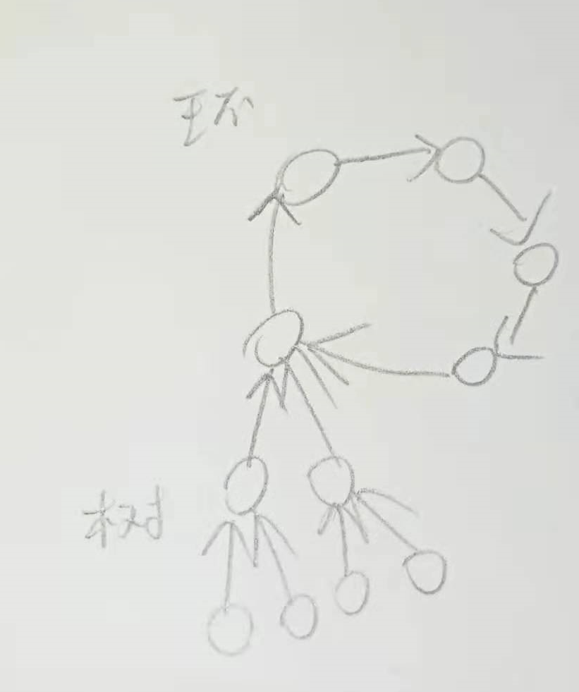
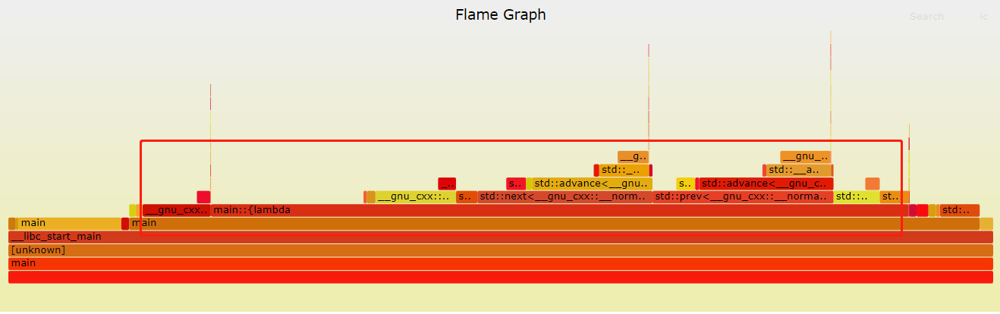

#ICPC 2019 World Final H题 Hobson's Train题解
这个题有点意思，简单写一下题解

#算法解析
算法总体上其实挺简单的，主要实现上比较繁琐，注意的细节要多一点，基本思路跟这个大神是一样的
https://github.com/SnapDragon64/ACMFinalsSolutions/blob/master/finals2019/hobsonstrainsDK.cc
，他的实现相当简单，只有55行，我的达到了134行。
因为每个节点只能有一个出度，所以形成的图只有两种可能。它要么就是一个树，方向指向根；要么就是一个环


并且图中一定会至少存在一个环（最小的是两个节点互相指向），可以用反证法，否则的话它肯定是一个树，树根没有出度，与题设不符；树根如果指向一个树中节点，此节点到树根的路径就会形成一个环。另外如果是有多个环，则它们一定不连通，否则肯定有一个节点超过一个出度。
算法就是随机从某一个节点开始，一路往前，记录下遍历过的节点，如果遇到碰到过的节点，那就是找到环的入口了。
然后从环的入口开始再遍历一次，直到再次遇到入口，记录下环上节点。
输入数据的时候，除了记录每个点的出站外，还要记录它们的入站有哪些。从环入口开始，通过之前记录的入站信息，找附着在环上的树（环上节点是树根，树是多叉树）。

对每颗树，用深度优先遍历，遍历过程中把节点加入到一个二维数组level_num中，第一维是层高，第二维是这一层的节点；设节点层是lv，递归函数开始前先记录一遍level_num[lv:lv+k+1]为sum1，即当前层和往后k层的节点总数，递归函数结尾再算一遍level_num[lv:lv+k+1]为sum2，sum2-sum1即是树中在不超过k的长度可以到达这个点的点数（不包括当前点）（因为遍历后和遍历前相比，增加的都是当前点的子节点，并且每个符合条件的点都是在这个过程中遍历的）。

统计完树中节点的k层可达后，再统计树中到圈中的k层可达，然后统计圈中到圈中的可达，最后每个点加上自身就行了。

#圈上的计数需要用差分数组记录

像上图的case，环上由n个点组成，每个环上点又带一个节点，组成一个两个节点的小树，再取k=2n-1，如果用数组记录环上的可达点的绝对值，那么记录树到环上的部分和环到环的部分，算法时间复杂度为O(n^2)，是会超时的。但如果这里用差分数组来记录那么复杂度是O(n)。

这里可以直接用perf工具看一下火焰图，程序会一直卡在统计树到圈上的部分（circ_next函数）。
https://raw.githubusercontent.com/CptJack2/icpc-challenge/master/2019/H/solution_img/perf.svg


```c++
auto circ_next=[&](vector<int>::iterator it){
    if(it!=prev(circle.end()))
        return next(it);
    else
        return circle.begin();
};
while(level_num.size()>1 && circ_it2!=circ_it){
    if(circ_l+level_num.size()-1>k){
        level_num_sum-=level_num.back();
        level_num.pop_back();
    }
    add_ans(*circ_it2,level_num_sum);
    circ_it2=circ_next(circ_it2);
    ++circ_l;
}
```
涉及到差分数组，让实现复杂了不少。生成火焰图的脚本可以看一下gen_flame_graph.sh

#最终实现，已有大量注释
https://github.com/CptJack2/icpc-challenge/blob/master/2019/H/main.cpp