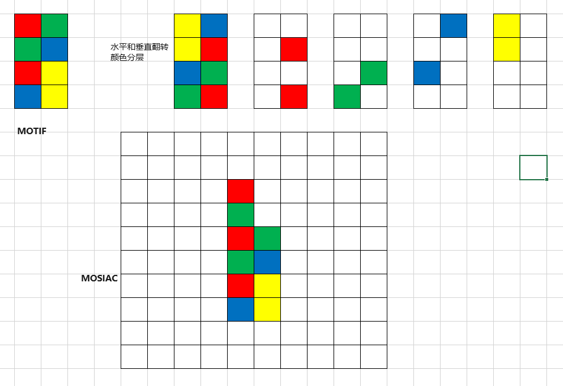
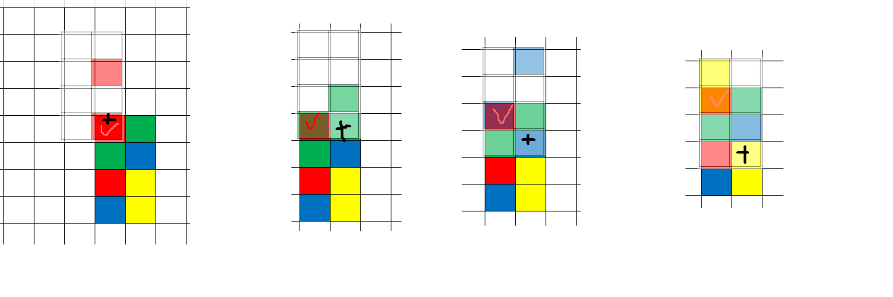

这一年忙着卖py，还有打羽毛球，都没什么时间做ICPC 2021的题，最近刚好给炒鱿鱼了，又有时间写了。

#A Crystal Crosswind
##题目大意
有一个dx x dy大小的晶体结构，‘#’的位置是晶体, '.'的位置是空格。科学家用指定方向的wind去窥探晶体，可以得出晶体的一部分边界结构，现在要你根据这些wind吹出来的结果，输出晶体可能的结构中，具有最多和最少晶格的两种结构。
##解法
这个题在这里面是挺简单的，首先建一个dx x dy的char二维数组graph来表示晶格结构，每个位置有三种取值‘?’、'.'和'#',分别代表未知,空位和晶格三种情况.最终的结果中,晶体结构一定包含了这三种符号,其中'#'和'.'代表这个位置一定是晶格或者空,而'?'的位置则可能是'#'或'.',分别把'?'替换成#和.,就可以得到最多和最少的两种结构了.
首先读入wind得到的'#'位置的数据,将graph中对应位置置为?,要注意,#位置对应的wind发出的位置,要置为.,否则这个位置是不可能探测出这个#的.然后遍历这个grid,并通过dfs或者bfs,将部分?识别为正确的#或.,减少未知的数量.
识别的依据有三条:
1.对于一个'#',如果它的上风位是'?',那这个'?'一定是一个'#'，否则如果'?'是'.',那么wind在扫到这个'.'的时候,第一个'#'会被认定为boundary,并且这个'?'在读入数据的时候就会被置为'.'，与当前状态矛盾了.
2.对于一个'.',如果它的下风位是‘?',那这个'?'一定是’.‘，否则如果'?'是'#'，那它一定是boundary，不可能没被发现
3.被wind从dx x dy的范围外指进来的'?'只能是'.'，如果是'#'也肯定会在boundary的列表内
最后根据graph中的状态输出两个结果就行了

#B Dungeon Crawler
##题目大意
有一个有n个房间的dungeon，共有n-1条走廊连接这些房间，每一条走廊有它的通过需要的时间。在每一个场景q中，地牢的其中两个房间被标记为K和T，并给出一个起点S，要求找出遍历完整个地牢并且先经过K再经过T的最少时间。可能不存在这样的路径，这种情况输出impossible。
##解法
n个节点，n-1条边，所以这个dungeon是一棵树，树边的权值是通过时间t。这道题目的本质是找树上的最长路径。
假设当树中没有K和T点，那么题目可以简化为找到从S点出发的树中最长的路径。沿着这条最长路径遍历整棵树，就可以得到最短的遍历长度，为树中所有边的长度的总和的两倍减去这个最长路径的长度。

如图中的树，红色的是最长路径，遍历过程中红色的路径只会经过一次，其余的黑色路径均会经过两次，一出一入。
现在的难点是最长路径需要先经过K点再经过T点。在每个场景中，固定了S、K、T三点，由于dungeon是一颗树，所以S到K，S到T的路径是存在且唯一的。设路径SK和ST的分叉点为J。

现在依然是要遍历树中的每个节点，寻找最长路径，对于不经过JK段的最长路径，不用做特殊处理，用它的长度计算即可；但对于经过JK段的路径，如图中从JK中间的J'分岔出去的路径，由于从S出发要先到K，然后再到T，再从J‘离开，所以JJ'间的节点实际经过了三次，所以计算最长路径的时候，要用路径长度减去JJ'之间的长度作为路径值。
基础的原理还是很简单的，现在算一下朴素算法的复杂度。从树中一点出发找它能到达的最长路径，可以从这点出发进行DFS，复杂度是O(N)；对n个节点进行操作，一共进行q次，复杂度就是O(qn)。在这里q可以达到2x10^4，所以要进行优化，以空间换时间，对一些计算结果进行缓存，使得每次查询的复杂度降低到O(logN)，总体复杂度降低到O(qlogN)。
第一步，以0号节点为根节点，通过一遍DFS，算出每个节点的高度和它通过每一个子节点分别能到达的最长距离。然后进行第二遍DFS算出每个节点从它的父节点离开能到达的最长距离，因为第一次的DFS已经算出每个节点从它的子节点离去的最长距离，第二遍DFS遍历到子节点的时候，父节点已经计算完成，所以父节点已经得到了从它所有邻接节点离开能到达的距离，所以可以算出当前节点通过它的父节点能到达的最长距离。完成第二遍DFS后，就得到了所有节点通过其邻接节点离去能到达的最大距离。这一步的复杂度是O(N)。
朴素的算法中提到了S到K的路径是求解问题的关键，由于这里人为的规定了0号节点为根节点，所以SK路径也可以人为的分为向上朝着根节点方向和向下离开根节点方向的两段。问题要求的是从S出发能到达的最长路径，并且这条最长路径与SK的分岔点J'和SK与ST的分岔点J之间的距离要被减去。第二步，就需要对每个节点计算一些调整好的距离数据，缓存起来，加速后面在SK路径上遍历每个节点的计算。
具体的缓存方法是树上的二进制跳转，计算缓存的过程也是DFS。通过第一遍DFS算出的每个节点的高度，根据高度的二进制表示的最后面0的个数，缓存它的对应的2^n号的祖先，比如高度为24即11000，就缓存这个节点的祖先路径上的1、2、4、8号祖先（1号祖先是父节点，2号祖先是爷爷节点），以及祖先路径上这个2^n祖先的前一个节点。这样的好处是，过来任意一个高度的节点，比如高度的二进制表示为1100111，通过一次跳转到高度为1100110，二次跳转到1100100，三次跳转到1100000，四次1000000，五次跳转到根节点。即每个节点都可以通过O(logN)次的跳转到达根节点。沿着SK路径遍历也可以改为沿着SK路径上的2^n祖先遍历，从而把O(N)次遍历优化为O(logN)次遍历。为了能在跳转遍历的时候就能获得路径上的点的最长路径值，第二步中就要通过dp计算出这些值并缓存起来。
通过动态规划，计算出跳转到2^n祖先的过程中经过的节点所能到达的最长路径，由于人为定义了树根，所以跳转分为上下两个方向，又由于路径分为与JK段重叠和不重叠，所以一共要通过DP计算出2x2=4类缓存结果。
以往上走不重叠为例，对于每个节点，前面根据其高度的二进制表示计算了若干个祖先，对于每个祖先，需要计算出，到达这个祖先，但不从这个祖先进入其它分支子树（这里很重要，因为无法确定其它分支子树在后续的query中会不会和JK段重合，所以只能计算到这个祖先为止），所能达到的最长路径。 对2^n祖先的最长路径的计算，可以用以下三个值的最大者得出：1.当前点到2^(n-1)级二进制祖先能达到的最大路径；2.当前点到2^(n-1)二进制祖先，然后转入它的另一子树，所能到达的最大路径；3.当前点到2^(n-1)二进制祖先，然后从那里走2^(n-1)二进制祖先到达它的2^(n-1)祖先（亦即当前点的2^n祖先）的最长路径。写成递推式UpNotOverlap[x][n]=max(UpNotOverlap[x][n-1], dist[x][n-1] + max(maxPathTurningIntoOtherSubTree[ancestor[x][n-1]], UpNotOverlap[ancestor[x][n-1]][n-1]))。
对于往下不重叠的路径计算也是类似的。而对于重叠版本的，由于到达2^(n-1)祖先的部分是与JK重合，所以在遍历中被走过3次，所以在计算最长路径的过程中，将这段的长度减去即可。
得到动态规划的结果后，每进来一个查询，只需要对SKT计算出到达路径，得到它们的公共祖先，将它们之间的路径划分成向上向下重叠不重叠4部分，然后通过之前的动态规划结果计算最长路径即可。

#C Fair Division
##题目大意
有n个海盗要分价值为m的赃物,每个人轮流拿一个比例f=p/q,直到无穷,要求最后每个海盗分到的都是一个整数,要求出这个最小的p和q,不可行就输出impossible
##
这是一个数论的题目.首先求解无穷级数,看看每个海盗分别分到多少

对于第k个海盗，他能分到的数量由上式给出，要每个海盗都分到整数，只需要mp/(q^n-(q-p)^n)是整数就可以了

另外化简一下式子，可以得出，当n>60时，一定是找不到f的解的。
接下来从q=2，p<q，一个个试能不能使mp/(q^n-(q-p)^n)是整数就可以了

#D Guardians of the Gallery
##题目大意
有一个由若干个顶点构成的多边形美术馆，在坐标S处有一个需要看守的雕像，有一个保安看门，他的起始坐标在G点。当保安移动到能够直视到雕像的位置即可。要求保安从居点出发，移动的最短距离。
##解法
这道题是一道计算几何的题目，但求最短路径的过程又用到了图论里的擦dijkstra算法。首先看两个典型的路径。

蓝点是G点，红点是S点。一个最短的路径肯定是从G出发，然后经过若干个多边形的顶点，最后到达多边形内的一点E，在这个点上可以直接看到S。
首先来分析一下多边形内哪些区域可以满足要求。图中标红的区域就是满足视线要求的区域，可以看到终点E一定是区域的边界上的一点。

像示例2这种特殊情况，①号区域由于只有单边有遮挡所以可以满足要求，而②号区域，双边都有遮挡，就不满足要求了。

第一步要把所有可能的终点E找出来，这些E点其实就是视野区域上面的临界点。首先通过S点向多边形的每一个顶点做射线，找出沿着射线能到达的最远的视野不被遮挡的点(图4的绿点，图3射线和水平的上边的交点)，这部分点是潜在的E点。然后对每条射线，遍历多边形的所有顶点，找出这些顶点到射线的垂直交点（就是求顶点到射线的最短距离，图3的绿点），这部分点也是潜在的E点。
求出所有的E点后，问题就变成了从G点出发，途经若干个多边形的顶点，然后到达一个E点，求一个最短距离。这里就变成了图论中的求从单是的一源点，到其他点的最短路径，可以使用dijkstra算法。初始的时候，将G点加入优先队列，当优先队列的根节点变成一个E点的时候，就可以结束求最短路径了，这个E点就是最短路径的终点。

#E Hand of the Free Marked
谁能想到啊，这题逼逼赖赖了一大通，其实就是个求排列组合的题。。。当M=1的时候，答案是min(A(N,K-1)/C(N,K) , 1)，即K-1张牌的排列总数是否可以表示所有K张牌的组合数。当M>1的时候，需要对K张牌分别每一类各有几张单独计算（因为魔术师看到牌的正面会知道牌的背面是什么颜色，最后一张反转的牌他能看到是什么颜色，所以他知道抽出来的牌各种颜色有多少，每种颜色组合可以作为一个独立子问题），如K=3，M=2，黑红两种牌各有5张，需要分为3黑，2黑1红，1黑2红，3红，4种情况算，以算2黑1红的概率为例，(C(5,2)+C(5,1)·C(5,1))·A(2,2)/C(5,2)·C(5,1)，2张用作排列的牌均从黑取，或一黑一红，除以总的3张牌组合数。总的概率就是4种情况的和。

#F Islands from the Sky
##题目大意
有一片由若干多边形构成的群岛，现在有若干条飞机航线，在每架飞机底部安装一个向两周拍摄为θ的摄像头，飞机飞行的线路是直线，起点终点海拔可能不一样，所以每架飞机能拍摄到的区域是一个梯形.同时要求每个岛都至少被一条航线完整拍摄一遍,如果有一个岛,没有一条航线能拍完整,即使多条航线能覆盖它的全部区域,也是不行的.现在问能够拍到群岛全景的最小θ是多少，如果拍不了全景输出impossible
##解法
由于是找一个对所有飞机生效的全局的θ，且只要求θ与正确值的误差在10^-6的范围内，所以可以用二分查找的方法确定θ的一个范围，并使范围小于10^-6就行了。
因为90÷2^27=0.00000067055225372314453125<10^-6, 所以只需要二分27次就足够了.
初始θ的范围定为(0,90°), 取区间的中点45°, 计算出航线得到的所有梯形, 是否能覆盖每一个岛, 并且每个岛都被某条航线拍完整了,判断方法可以用梯形是否包含岛的每一个顶点.梯形是否包含一个点,通过在这个点向任意方向,作一条无穷远的射线,看和梯形的4条边,相交了几次,如果是奇数次那么梯形包含这个点,偶数次就不包含.
如果这个θ能够包含所有岛屿,就将它设为区间上界,否则设为下界.如果最后θ还是90°,那么就是无法覆盖群岛,输出impossible.

#G Mosaic Browsing
##题目大意
有一个rq x cq大小的方块mosiac,每一块都是一种颜色,还有一个rp x cp的pattern motif,里面的一些块有颜色,还有一些没颜色的通配符,现在要在mosiac里找出所有能和motif匹配上的位置.
##解法
这是一个二维的匹配问题,如果用滑动窗口逐一匹配的话,复杂度达到O(rpxcpxrqxcq)，根据问题规模，比对最多需要10^12次,运行太久了。
这个解法的核心思路也是滑动窗口，不过采用了一些技巧减少了比对次数。注意到问题限定只有100种颜色，可以将每种颜色分开成一个单独图层，将每种颜色分开后，可以只用01表示这个位置有没有对应的颜色，motif的每一列可以以bitset的形式储存，在mosiac上不断滑动来进行比较。
比对前先要对motif做一些预处理。先将它进行一次水平翻转然后一次垂直翻转，再按每个颜色分开成一个单独图层（如果碰到wildcard直接按空处理），作为模板。
然后在mosiac上滑动，读入那一格的颜色，使用对应颜色的motif模板，右下角置于这一格。
看一个例子

十字格是当前滑动的位置，用对应颜色的模板的右下角放置在十字格，可以发现motif上打√的红格都是能匹配上的。这就是翻转的目的，在判断这个红格能不能作为一个匹配起点的过程中，不断滑动，如果有一个motif的颜色匹配不上，那么就必然有一次操作红格是不能打√的。即通过当前格的颜色，反推前面哪些格是可以作为起点的。同时，每次的模板匹配就能够确定motif大小的范围内的方格是否能匹配上。

有了上面的基础，可以建立一个fail矩阵，大小和mosiac大小一致，用来表示以这个位置作为motif的左上角能否匹配，初始化置为0，在后面的过程中不断把无法匹配的位置置1，最后遍历检查，为0的位置就是匹配上的位置。至于为什么用fail语义不用success语义，主要是因为用bitset存储motif的分层模板，需要用左移右移操作去和mosiac对齐，而移位操作是用0补位的，刚好符合fail语义。
算法能节约比对次数在于，通过bitset的&操作，一次就比对了motif的一列，同时最多只有100种颜色，在mosiac一行的滑动中最多只需要比对100次。 所以计算量能优化到O(rpxcqx100)，即最多10^8次计算。

#H Prehistoric Programs
##题目大意
有n个由'('和')'组成的字符串，问能不能将它们按一定顺序拼接，组成一个所有左括号和右括号都能匹配上的串。
##解法
用贪心法就可以获得一个解。先读入所有串,统计每个串左括号和右括号的数目,根据左括号多于右括号还是右多于左,分为两类,称为左串和右串.最终排列时，左串先排完，然后轮到右串排，如果有解一定能得到一个解。如果左右括号总数目对不上肯定无解了。
现在只讨论左串的情况，因为右串可以想象成在最终串中，从右往左读，从而可以沿用左串的处理办法。
前面对左串中，左括号减去右括号的数目，称为顺差。每个串还有一个逆差，即从左往右扫的过程中，右括号最多比左括号多出现的次数，如')((('，它的顺差是3-1=2，逆差是1。逆差的意义是，在左串的排列中，它的上一个串的顺差必须要大于等于它的逆差，否则就会有右括号配不上左括号的情况。
所以对于左串的贪心算法，可以对每个左串根据逆差作为第一排序依据，从小到大排序，顺差作为第二排序依据从大到小排序，这样就可以生成一个合法的左串。右串类似处理，最后左右串拼起来就行了。

#I Spider Walk
##题目大意
有一个蜘蛛网，从中心出发向外有若干个strand，同时有若干个bridge连接相连的两个strand，蜘蛛从中心出发，遇到bridge一定要走，现在指定一条strand，问从任意strand出发，最小要添加多少个bridge才能到达指定strand
##解法
首先要注意，任意两个相邻strand的答案相差最多为1，因为可以在所有bridge之前建一个bridge转移到相邻的strand，从而沿用这个strand的最短路径。
先考虑没有bridge的情况，这样的话，被指定的strand需要添加的bridge就是0，从这个strand向两边的strand，每隔一个答案就需要的bridge +1.
接下来把所有bridge按距离中心的距离从大到小排序，一个个添加到网中，然后更新答案。之所以要从大到小，是因为对于一个现有网，在最靠近中心的位置添加一个bridge，不会影响过了这个添加点后的原来的最短路径。
接下来分析每次新添加的桥对现有局面造成的影响。被新桥连接的两个strand，它们的数目要交换，因为蜘蛛一定要经过这个新桥。另外对于那些本来就要在这两个strand间建桥的，它们的桥数都可以-1，识别出这些strand的方法就是看添加前它们和相邻strand的答案差别。
最后是实现上需要注意的，由于strand数n最大是2*10^5,bridge数m最大是5*10^5，如果采用储存每一个strand的答案的方法，复杂度会达到O(mn)，即10^11.要减少计算量，需要采用压缩存储的方法。记录答案为0的strand，通过记录答案变化的斜率区间进行压缩，这样可以把复杂度减少到O(m)，注意添加bridge的时候对压缩数据结构的更新就行了。

#J Splitstream
##题目大意
用一个1..m的连续自然数列模仿河流，有若干split和merge节点，分别模拟分割和合并，对于一个给定的河流结构有q个查询，每个查询要给出第x号output的第k个数字是什么。
##解法
输入stream的长度为m，用一次DFS把每一个输出stream的长度计算出来，然后每次query读入stream序号x和要求的k号元素，先根据前面DFS算出的stream size判断k号元素是否存在，然后从这个节点开始模拟河流的结构回溯到第一个node，看看这个k号元素对应的是哪一个input就行了。

#K Take on Meme
##题目大意
有一系列meme的选举比赛，连接成一个树形结构。每个节点可以选出其中一个节点将权重置为1，其他节点权重置为-1，求和后来作为这个节点的值。要求根节点的值的距离原点的欧几里得距离的最大值。
##解法
每一个节点经过这些操作后，可能得到的值的点集是一个minkowski sum集合，具体看这个链接。
minkowski sum
https://cp-algorithms.com/geometry/minkowski.html
现在要求根节点的点集中欧几里得距离最大的，可以确定的是，这个点集可以找到一个凸多边形的包围（凸包），而欧几里得距离最大的点一定是在凸包的顶点上。由于这里都是线性操作，按求minkowski sum的流程求出凸包，再一个个比较凸包上的点的大小也可以求解。
这里通过的是类似贪心法的方法，初始先确定一个随机向量，沿着这个随机向量的正负两个方向找到最外围的两个点。然后沿这两个点的垂线的方向往外找，如果能找到更远的点，就用这个更远的点分别和两个点作连线，向垂线的方向找，直到找不出更远的点为止。因为任选两个点，最远的点要不在两点连线的左边或者右边，所以这样的算法一定能找出实际最远的点。
在某个方向上确定最远，通过在根节点DFS，每次递归返回一个最大和最小值，大小通过在寻找方向的向量上的投影长度确定。

#L Where Am I?
##题目大意
