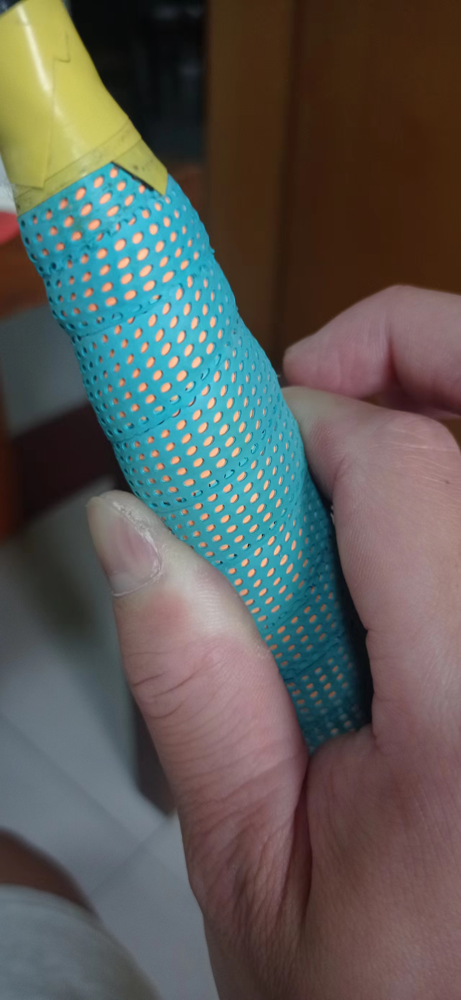
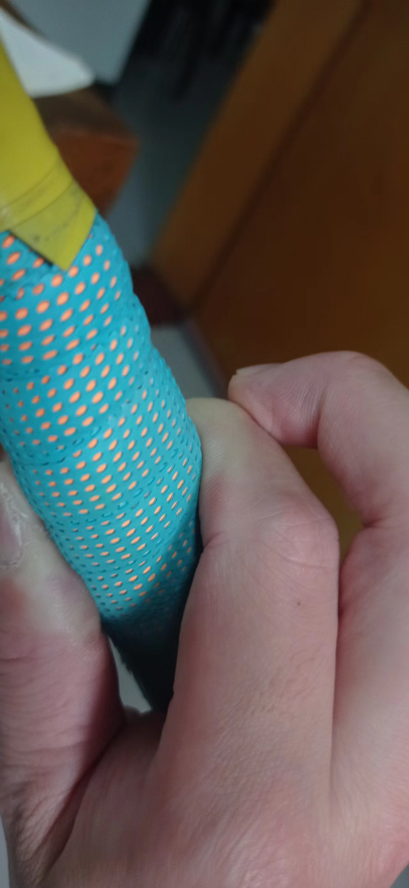
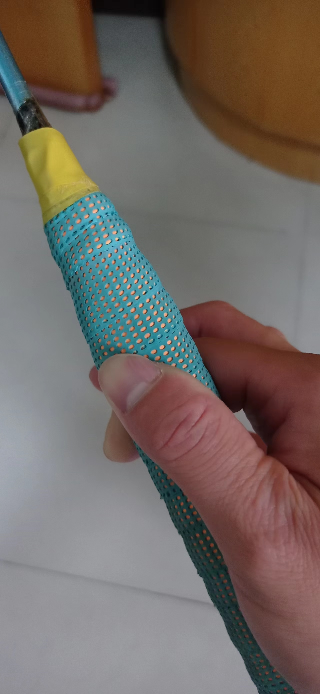
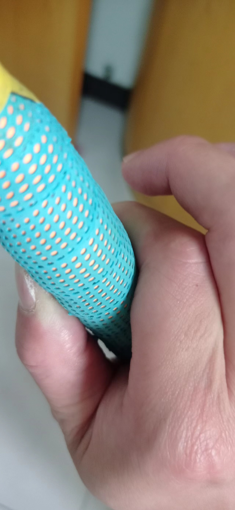
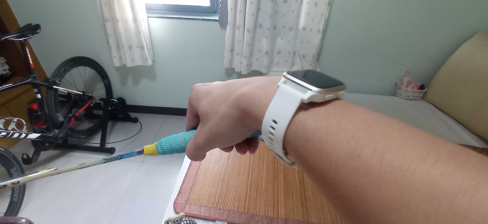
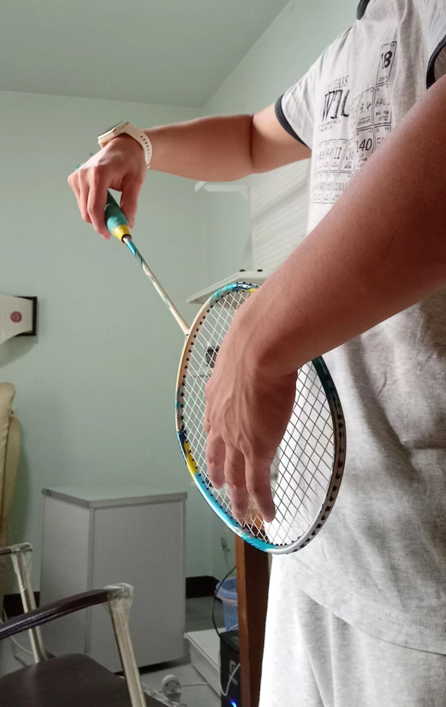
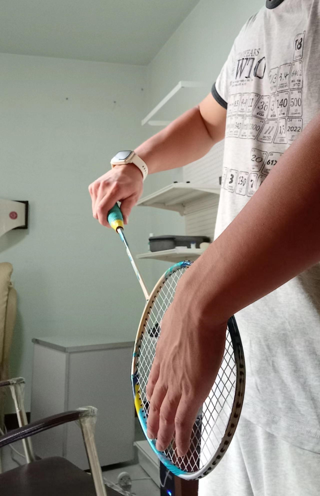

学球的时候，教练都只强调正手握拍和反手握拍，但我发现在双打中，这两种握拍技巧很难应付正面来的平球。
实际上，握拍有很多方式，分别来处理各种不同的来球。

【握拍】4种羽毛球握拍方法（正手握拍，反手握拍，斜棱握拍，苍蝇拍）by Badminton Insig
hthttps://www.bilibili.com/video/BV1YF411K7Up?vd_source=4f8706e4f5f43018115c2b18cecd8b65
视频在3:00的时候，有四种握拍方式对应的不同角度。
视频里的总结：
正手握拍：握菜刀，虎口对着拍框（也可以逆时针转一个小角度）。打所有正手后场球（高远球、吊、杀）、正手前场挑球和放网
反手握拍：握平底锅，拇指顶着握拍宽面，球拍角度刚好是正手握拍转过90°。打反手发球、反手抽球、双打防守。不要用来打反手后场。
斜棱握拍：正手握拍转过45°，刚好在正反手握拍的角度中间。打正手/反手放网、正手/反手防守、反手后场。 
苍蝇拍：虎口对着拍面。打很被动的反手后场。

在握拍技巧里，握拍角度只是一方面，大拇指、食指和其他手指还要起到支撑球拍，控制球拍方向，传导力量的作用，手指的放置也是有技巧的。
手指握拍大部分时间是要松驰的，这样通过五个手指对球拍的角度控制才能有更大更灵活的出球角度；用力击重球的时候才握实，这样保证球拍不会乱动，才能控制重球的方向不出界。

其实大可以把握着球拍的手想象成身体多出了一个关节，握拍的角度可以通过旋转，来应对射向身体不同位置的球。
比如正前方来的正手前场平抽挡和正前方的扑球，就用虎口对着球拍面（握把宽面），这就是经常被半桶水耻笑的苍蝇拍。
反手前场平抽挡，就用拇指顶着球拍宽面。
挑球因为出球角度和高度的不同，可以在正手握拍的基础上进行微调。
打高远球，虎口对着斜边，充分利用转体的力量，这就是教练常教的正手握拍。

#用手指打球
指的是手指要灵活，不能总是死死的拽紧球拍。手指、手掌和拍握把需要保持一个灵活的状态，就像人身上多出来了一个关节。这样才能在主动被动等各种情况下保证最大的击球角度。如果手指拽死嗯，仅靠腕关节、肘关节和肩关节，那会损失很多的灵活度。
#击球前手指为什么不能抓死
手指需要旋转球拍调整握拍角度，如果抓死了，握拍角度就调整不了。
击球前的第一个动作都是用手指旋转球拍，找好角度。角度确定后，才用食指和大拇指用力顶住球拍，来控制拍的方向，后三指负责用力挥拍和控制球拍倾斜角度。

正手手指固定球拍：大拇指在侧面顶住，食指前两个指关节紧紧贴住球拍，形成三点稳固的固定。
 
反手手指固定球拍：大拇指在后面顶住，食指前两个指关节紧紧贴住球拍，形成三点稳固的固定。
 

手指调整球拍角度可以在引拍前做，也可以一边引拍一边做，但不能球拍向前挥出才做，因为这时候球拍已经有了速度，不把它抓牢，就会晃来晃去导致击球速度，导致击球角度不准，甚至拍直接飞出去。
通过上面说的手指技巧，手指、手掌和拍握把就形成了一个灵活的关节，可以最大限度的击出角度刁钻的球。

#反手发高远球技巧
反手发高远球是一个比较难的动作，因为局促在身前发力空间小，也用不了腰腹带动主要靠手指、手腕和手肘的力量击球。
如果是发小球那么力量绰绰有余，但如果是发高球那就很困难了，这样会导致发的球不到后场，甚至是个中场高球别人一拍杀球就没了。可以使用扣腕的技巧，充分发挥肘关节的力量。
如图所示，就是将手腕往回扣，这样在身前发力，肘关节的活动范围就会变大，从而充分发挥肘关节的力量。

这个图中做了扣腕的动作，可以看到球拍到左手的时候，手肘是抬高的。球拍从身体左侧过来，肘关节有充分的活动范围，从而击球有力。

而这个图中没有做扣腕动作，球拍到左手，手肘抬不起来，肘关节活动空间小，击球自然就没有力量。

#握拍角度
变换握拍角度的原则是，使得拍面正对着击球方向，这样引拍后用鞭式发力技巧，反转力量就可以立刻出拍击球，同时挥拍方向与来球方向一致，便于击球。
如果握拍角度不对，手腕或者手肘总要掰过来一定角度以迎合来球方向，这样就会损失力量，也容易使关节受伤。
其实初学者的苍蝇拍，就是虎口对着球拍宽面的握法，也是符合人体结构的，因为他们不会利用转身的腰部力量，手肘带着小臂苍蝇拍出去就是迎着关节的正确出力方法。
但运动员要虎口对着斜边，是因为他们要转身发力，身体转过去后，球拍就会正对前方。

归根到底，是因为小臂的内旋（100°-110°）和外旋（80°-90°）的角度限制了手腕的朝向角度，所以就要通过变换握拍角度来使拍面总能在击球的瞬间朝向击球方向，同时手腕、手肘和肩三个关节都处于正常的活动角度内，这样才能保证最大的击球力度、准度和便捷性，以及身体健康。